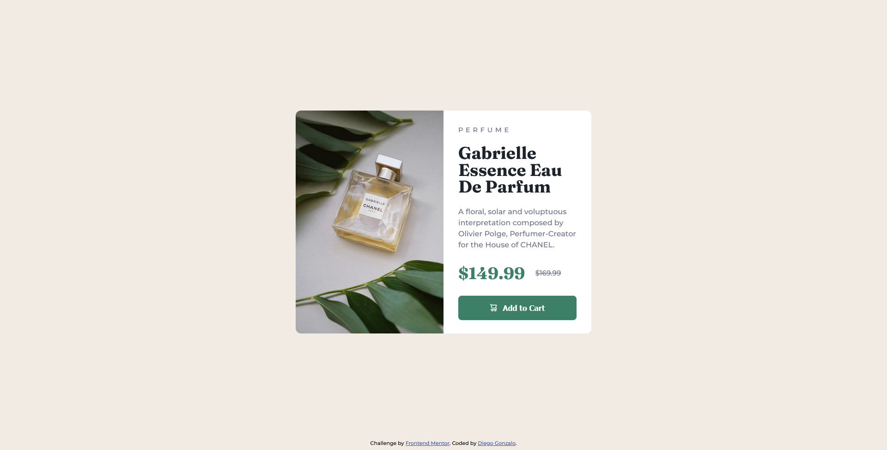

# Frontend Mentor - Product preview card component solution

This is a solution to the [Product preview card component challenge on Frontend Mentor](https://www.frontendmentor.io/challenges/product-preview-card-component-GO7UmttRfa). Frontend Mentor challenges help you improve your coding skills by building realistic projects. 

## Table of contents

- [Frontend Mentor - Product preview card component solution](#frontend-mentor---product-preview-card-component-solution)
  - [Table of contents](#table-of-contents)
  - [Overview](#overview)
    - [The challenge](#the-challenge)
    - [Screenshot](#screenshot)
      - [Desktop solution image](#desktop-solution-image)
      - [Mobile solution image](#mobile-solution-image)
    - [Links](#links)
  - [My process](#my-process)
    - [Built with](#built-with)
  - [Author](#author)

## Overview

### The challenge

Users should be able to:

- View the optimal layout depending on their device's screen size
- See hover and focus states for interactive elements

### Screenshot

#### Desktop solution image

#### Mobile solution image

### Links

- Solution URL: [GitHub Repository](https://github.com/diegonzalodev/product-preview-card-component)
- Live Site URL: [GitHub Pages](https://your-live-site-url.com)

## My process

### Built with

- HTML5
- CSS:
  - Bem methodology
  - SASS preprocessor 
- Flexbox
- Mobile-first workflow

## Author

- [Diego Gonzalo](https://github.com/diegonzalodev)
- Frontend Mentor - [@diegonzalodev](https://www.frontendmentor.io/profile/diegonzalodev)